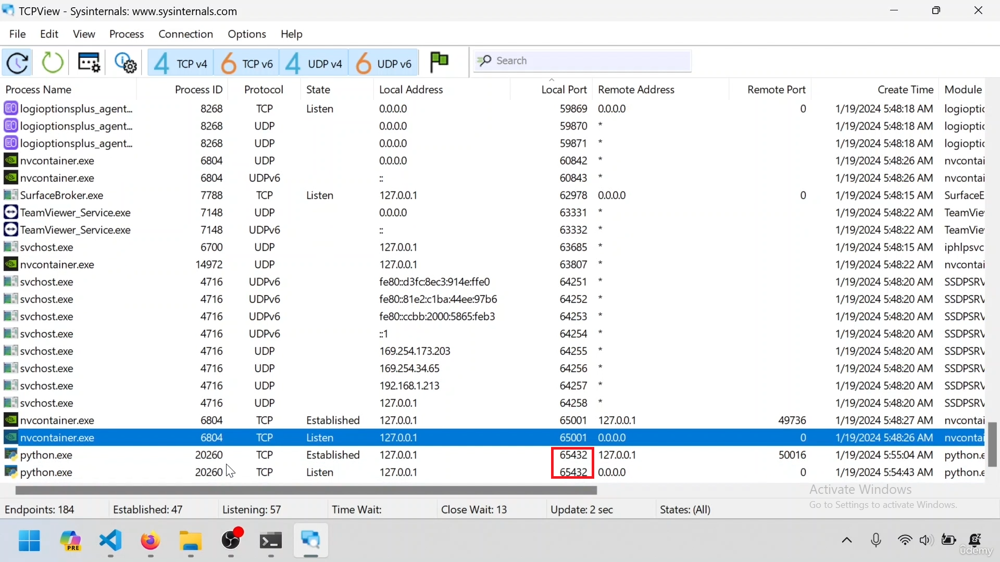

---  
---  

1 : Which command is used to check active network connections and their associated programs in Windows?  

a) ipconfig  
b) ping  
c) netstat  
d) None of the above  

**Answer** c)  

**Description**  

The netstat command displays active network connections and their associated programs, helping diagnose network issues.  

---  
---  

2 : What is the purpose of TCP View?  

a) Text Editor  
b) Debugger  
c) An application that provides a detailed and dynamic view of all TCP and UDP endpoints on a system  
d) None of the above  

**Answer** c)  

**Description**  

TCP View is a Windows-based application that provides a detailed and dynamic view of all TCP and UDP endpoints on a system.  

---  
---  

3 : What does the IP address "127.0.0.1" in the TCP view represent here?  

a) The server's external IP address  
b) The client's external IP address  
c) The loopback IP address  
d) The router's IP address  

**Answer** c)  

**Description**  

The IP address "127.0.0.1" represents the loopback IP address. This address is used to refer to the local machine itself, allowing network communications to loop back to the same device without going through a physical network interface. It is commonly used for testing and troubleshooting network-related issues.  

---  
---  

4 : What does the IP address "127.0.0.1" in the TCP view represent here?  

a) The server's external IP address  
b) The client's external IP address 
c) The loopback IP address  
d) The router's IP address  

**Answer** c)  

**Description**  

The IP address "127.0.0.1" represents the loopback IP address. This address is used to refer to the local machine itself, allowing network communications to loop back to the same device without going through a physical network interface. It is commonly used for testing and troubleshooting network-related issues.  

---  
---  

5 : What does the port number "65432" in the TCP view signify here? 

  

a) The server's listening port  
b) The client's listening port  
c) A random port assigned by the operating system  
d) The default port for TCP communication  

**Answer** a)  

**Description**  

The port number "65432" signifies the server's listening port. This port is used by the server to accept incoming connections from clients. It is a specific port configured within the program for communication purposes.  

---  
---  

6 : What is the significance of the different process IDs (PID) observed in the TCP View?  

a) They represent the port each process listen  
b) They indicate different programs or applications  
c) They are randomly assigned by the operating system  
d) They correspond to specific network protocols  

**Answer** b)  

**Description**  

The different process IDs (PID) observed in the TCP View indicate that each entry corresponds to a different program or application running on the system. Each PID uniquely identifies a separate instance of a program, suggesting that multiple programs are involved in network communication.  

---  
---  

