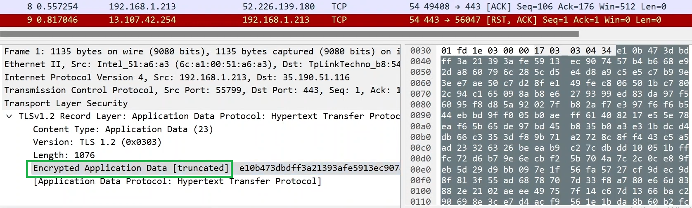
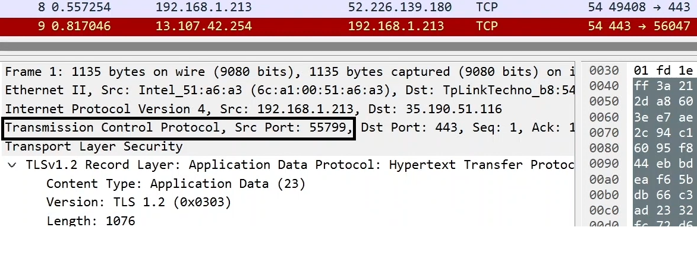

---  
---  

1 : Which command is used to display the IP addresses and network interfaces on a Windows system?  

a) ifconfig  
b) netstat  
c) ipconfig  
d) None of the above  

**Answer** c)  

**Description**  

The ipconfig command is used on Windows systems to display the IP addresses and network interfaces.  

---  
---  

2 : What command is used on Linux systems to display network interfaces and IP addresses?  

a) ipconfig  
b) netstat  
c) ifconfig  
d) route  

**Answer** c)  

**Description**  

The ifconfig command is used on Linux systems to display network interfaces and IP addresses.  

---  
---  

3 : What does the MAC address represent?  

a) The physical address of network interfaces  
b) The logical address used by software  
c) The encrypted data being sent  
d) The IP address of the source  

**Answer** a)  

**Description**  

The MAC (Media Access Control) address represents the physical address of network interfaces, which is a unique identifier assigned to network interfaces for communications on the physical network segment.  

---  
---  

4 : What protocol is indicated by the layer showing "encrypted data" in the Wireshark output?  

  

a) HTTP  
b) TCP  
c) TLS/SSL  
d) DNS  

**Answer** c)  

**Description**  

The layer showing "encrypted data" in Wireshark indicates the use of TLS (Transport Layer Security) or SSL (Secure Sockets Layer), which are protocols used to encrypt data for secure communication over a network.  

---  
---  

5 : What is the purpose of the NAT (Network Address Translation) technique?  

a) To translate domain names to IP addresses  
b) To convert private local IP addresses to public IP addresses  
c) To encrypt data being sent over the network  
d) To assign MAC addresses to devices on a network  

**Answer** b)  

**Description**  

NAT (Network Address Translation) is used to convert private local IP addresses (such as those assigned by a home router) to public IP addresses that can be used on the internet, allowing multiple devices on a local network to share a single public IP address.  

---  
---  

6 : What information does the source port number in the TCP layer indicate in the below Wireshark output?  

  

a) The destination application on the remote system  
b) The application responsible for sending the packet on the local system  
c) The physical address of the local network interface  
d) The IP address of the destination system  

**Answer** b)  

**Description**  

 The source port number in the TCP layer indicates the application responsible for sending the packet on the local system. Each port number is associated with a specific application or service.  

 ---  
 ---  

   

