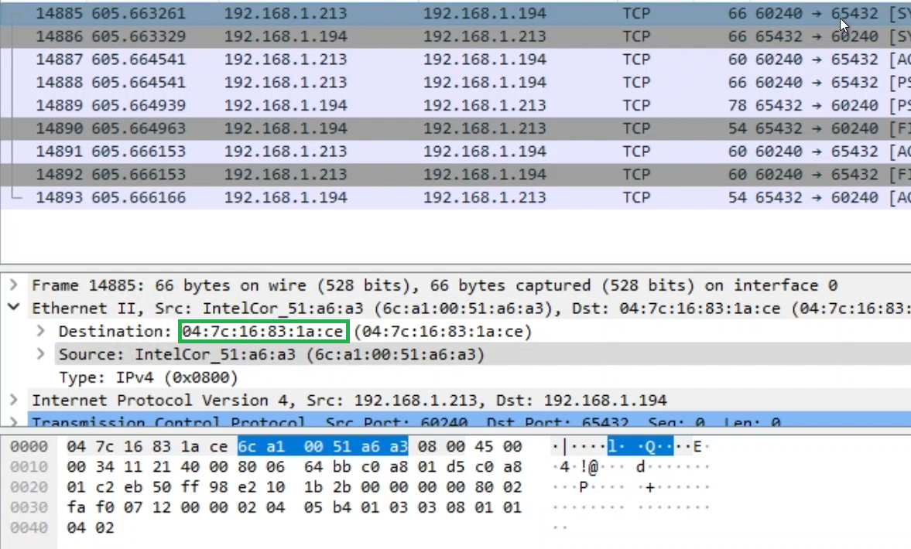

---  
---  

1 : What is the primary purpose of a checksum in network packets?  

a) To encrypt the packet data for security  
b) To validate the integrity of the data  
c) To assign a unique identifier to each packet  
d) To determine the packet's destination address  

**Answer** b)  

**Description**  

A checksum is used to verify that the data has not been altered or corrupted during transmission.  

---  
---  

2 : What does the destination MAC address in the SYN packet captured using Wireshark indicate?  

  

a) Destination MAC address which is the physical address of the device the packet is going to  
b) Destination MAC address which is the physical address of the device the packet is generated  
c) The destination MAC address is always the IP address of the device the packet is going to  
d) None of the above  

**Answer** a)  

**Description**  

The destination MAC address is the physical address of the device the packet is going to. Here the SYN packet is going from client to server. So the destination MAC address of the SYN packet is the MAC address of the server.  

---  
---  

