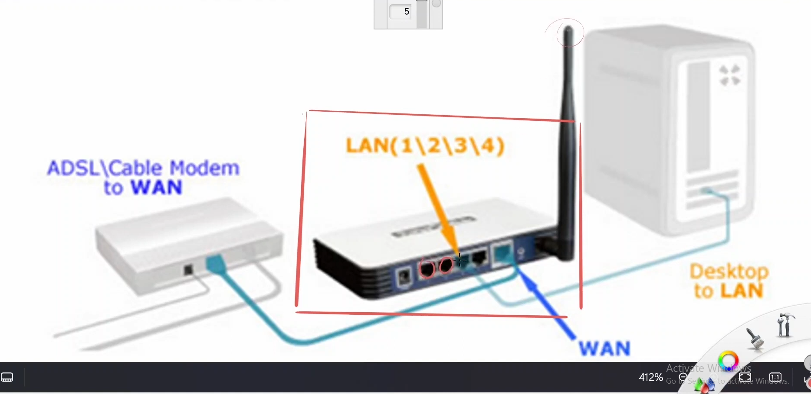

---  
---  

1 : What is the purpose of the WAN port in the Wi-Fi router setup described in the lecture?  

a) Connects to the LAN  
b) Connects to the Internet or another router  
c) Connects to the client device directly  
d) Provides power to the router  

**Answer** b)  

**Description**  

The WAN (Wide Area Network) port is used to connect the Wi-Fi router to the Internet or another router, providing a gateway for external network access.  

---  
---  

2 : What is the device inside the red square of the below picture?  

  

a) Hub  
b) Layer 2 switch  
c) WiFi Recorder  
d) Router  

**Answer** d)  

**Description**  

The device in the picture inside the red square is a router.  

---  
---  

3 : What are the ports highlighted in green in the below diagram of a router called?  
