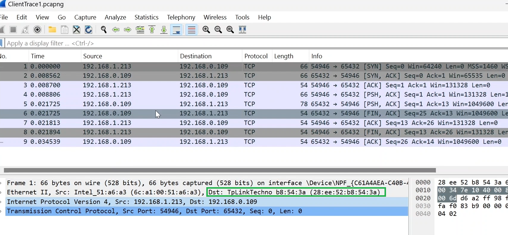

---  
---  

1 : In the below setup discussed in this lecture, the WAN port of 'piggy' router is connected to ____________.  

  

a) The ISP (Internet Service Provider) modem  
b) The LAN port of the 'booblie' router  
c) The WAN port of the 'booblie' router  
d) To the client laptop  

**Answer** b)  

**Description**  

The WAN port of 'piggy' router is connected to the LAN port of the 'booblie' router.  

---  
---  

2 : What does the client-side trace from Wireshark reveal about the MAC address of the destination in the setup discussed in this lecture?  

  

a) It matches the server's MAC address  
b) It matches the 'piggy' router’s LAN interface MAC address  
c) It matches the 'piggy' router’s WAN interface MAC address  
d) It matches the client's MAC address  

**Answer** b)  

**Description**  

It matches the LAN interface MAC address of the 'piggy' Router.  

---  
---  

3 : What is the mac address of the internet interface of the router piggy? Refer from the below diagram.  

