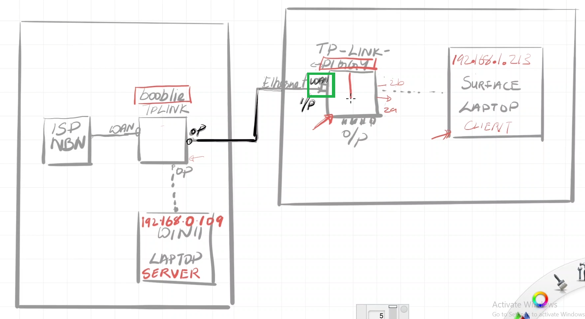

---  
---  

1 : In the below setup discussed in this lecture, the WAN port of 'piggy' router is connected to ____________.  

  

a) The ISP (Internet Service Provider) modem  
b) The LAN port of the 'booblie' router  
c) The WAN port of the 'booblie' router  
d) To the client laptop  

**Answer** b)  

**Description**  

The WAN port of 'piggy' router is connected to the LAN port of the 'booblie' router.  

---  
---  

2 : What does the client-side trace from Wireshark reveal about the MAC address of the destination in the setup discussed in this lecture?  

