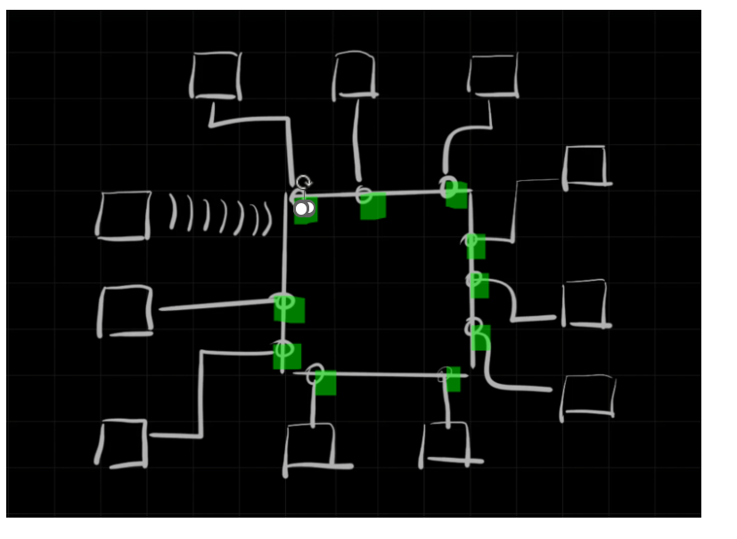
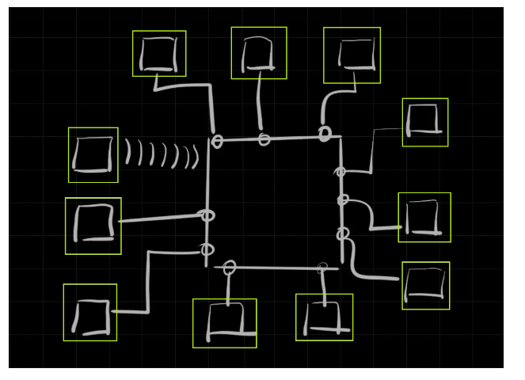
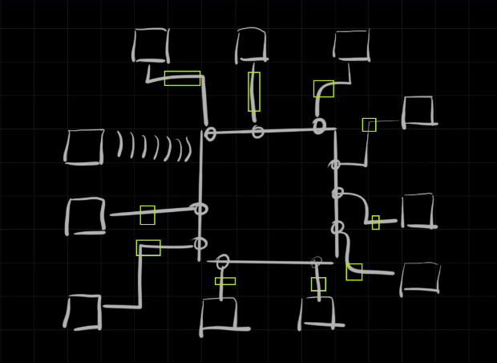
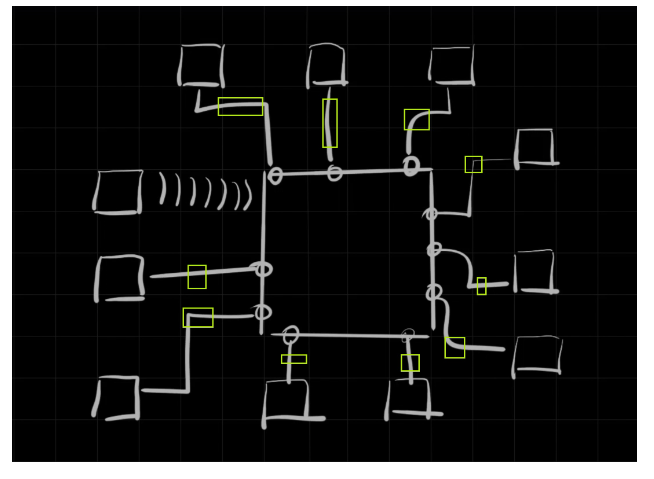
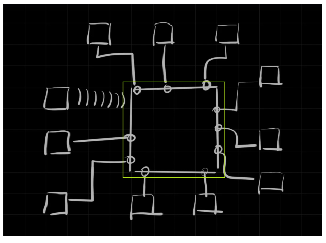

---  
---  

1 : What type of cable is most commonly used to connect computers in a subnet to a router?  

a) USB cables  
b) HDMI cables  
c) Ethernet cables  
d) None of the above  

**Answer** c)  

**Description**  

Ethernet cables are used to connect devices within a local area network (LAN), including connections between computers and routers.  

---  
---  

2 : What is NOT a characteristic of the MAC address in the context of a subnet?  

a) It is part of the hardware  
b) It is unique to each NIC  
c) It is assigned by the router  
d) It is used to identify devices within a subnet  

**Answer** c)  

**Description**  

The MAC address is embedded in the hardware and is unique to each Network Interface Card (NIC). It is not assigned by the router but it is used by the router for internal communication.  

---  
---  

3 : How is the network interface card (NIC) connected to a computer?  

a) Via USB port  
b) Via HDMI port  
c) It is embedded into the CPU  
d) Via the PCI slot on the motherboard  

**Answer** d)  

**Description**  

The NIC is connected to the computer through the PCI slot on the motherboard, enabling network connectivity.  

---  
---  

4 : Referring to the image below from the lesson what is the highlighted part in green?  

  

a) Router  
b) Ethernet port of Router  
c) Ethernet port of NIC  
d) Ethernet cable  

**Answer** b)  

**Description**  

It is the Ethernet port of Router. An Ethernet port is also known as a LAN port.  

---  
---  

5 : Referring to the image below from the lesson what is the highlighted part in green square?  

  

a) Router  
b) Ethernet port of Router  
c) Computers with NIC  
d) Ethernet cable  

**Answer** c)  

**Description**  

Computer with NIC is what is represented in green.  

---  
---  

6 : What unique identifier does each computer use to communicate within a subnet?  

a) IP address  
b) MAC address  
c) Hostname  
d) Subnet mask  

**Answer** b)  

**Description**  

Within a subnet, the MAC address is used as the unique identifier for each computer to facilitate data transfer between them.  

---  
---  

7 : What role does the Wi-Fi router or switch play in a subnet?  

a) It assigns IP addresses to computers  
b) It reads the data packets' source and destination MAC addresses and routes them accordingly  
c) It provides wireless internet access only  
d) None of the above  

**Answer** b)  

**Description**  

It reads the data packets' source and destination MAC addresses and routes them accordingly.  

---  
---  

8 : What is a Wifi router?  

a) Router  
b) A purpose build computer  
c) A device computers are connected  
d) All of the above  

**Answer** d)  

**Description**  

A router is a purpose build computer to which computers are connected to.  

---  
---  

9 : How many Ethernet port a Wifi router can have?  

a) 1  
b) 2  
c) 3  
d) Many  

**Answer** d)  

**Description**  

Correct. A Wi-Fi router typically comes with multiple Ethernet ports, which can vary depending on the model and brand.  

---  
---  

10 : What is the single most important purpose of MAC address?  

a) To determine the source and destination of computers connected to a subnet  
b) To encrypt data during transmission  
c) To determine the IP address of a device  
d) All the above  

**Answer** d)  

**Description**  

Correct. mac address is used to determine the source and destination of computers connected to a subnet.  

---  
---  

11 : How a computer get its MAC address?  

a) It is embedded inside the hardware  
b) Assigned by the Operating System  
c) Generated by the DHCP Server  
d) Configured by the User  

**Answer** a)  

**Description**  

Mac address is embedding inside the hardware.  

---  
---  

12 : Between what and what the ethernet cable is connecting in the previous lecture?  

  

a) Internet and client  
b) NIC card and Router  
c) Server and client  
d) None of the above  

**Answer** b)  

**Description**  

NIC card and Router is connected by an ethernet cable.  

---  
---  

13 : What number is unique for a particular NIC card?  

a) MAC address  
b) IP address  
c) Binary address  
d) None of the above  

**Answer** a)  

**Description**  

MAC address is unique for a particular NIC card.  

---  
---  

14 : When the packet is routed within the subnet which layer is being read by the Router?  

a) Layer 2  
b) Layer 4  
c) Layer 1  
d) Layer 7  

**Answer** a)  

**Description**  

Layer 2 is being read by the Router When the packet is routed within the subet.  

---  
---  

15 : Referring to the image below from the lesson what is the highlighted part in green square?  

  

a) Router  
b) Ethernet port of Router  
c) Computers connected to subnet with NIC  
d) Ethernet cable  

**Answer** d)  

**Description**  

It is the ethernet cable connecting the NIC card of the computer to the ethernet port of the router.  

---  
---  

16 : Referring to the image below from the lesson what is the highlighted part in green square?  

  

a) 

