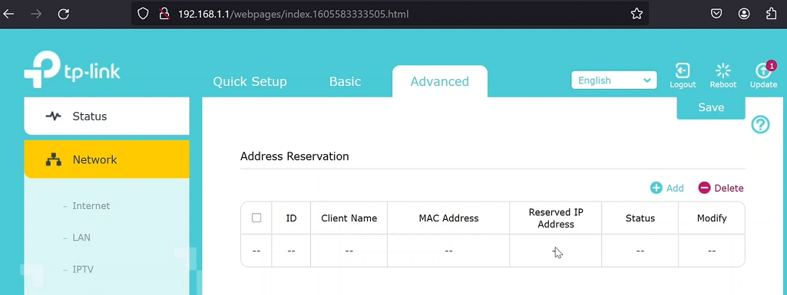
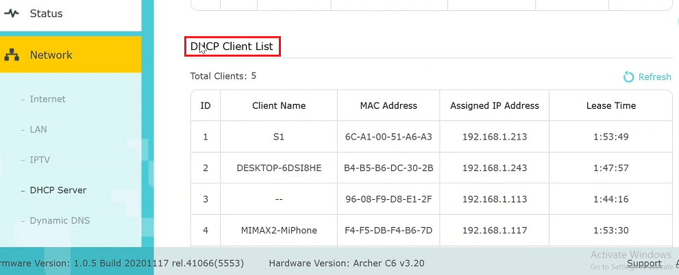

---  
---  

1 : What does DHCP stand for?  

a) Dynamic Host Configuration Protocol  
b) Dynamic Host Control Protocol  
c) Dynamic Hypertext Configuration Protocol  
d) Direct Host Configuration Protocol  

**Answer** a)

**Description**  

DHCP stands for Dynamic Host Configuration Protocol, which is used to assign IP addresses to devices on a subnet.  

---  
---  

2 : What is true about DHCP?  

a) DHCP is used to assign IP addresses  to devices on a subnet  
b) DHCP assigns IP addresses to devices for a specific period known as the address lease time  
c) DHCP can provide devices with other important subnet configuration information, such as the default gateway, subnet mask, and DNS server addresses  
d) All the above  

**Answer** d)

**Description**  

All the above stated comments are true about DHCP.  

---  
---  

3 : Which of the following is NOT provided by DHCP server to client during the IP address allocation process?  

a) Subnet Mask  
b) Default Gateway  
c) MAC Address  
d) DNS Server  

**Answer** c)

**Description**  

MAC address is not given by DHCP. The MAC address is a hardware address and does not change.  

---  
---  

4 : What is DORA in the context of DHCP?  

a) DORA is an acronym that represents the four-step process used by the DHCP to assign IP addresses to devices on a subnet  
b) DORA is a fictional cartoon character who explores the world  
c) DORA is the application running the DHCP server  
d) None of the above  

**Answer** a)  

**Description**  

DORA is an acronym that represents the four-step process used by the Dynamic Host Configuration Protocol (DHCP) to assign IP addresses to devices on a subnet.  

---  
---  

5 : What does the 'D' in the DORA process of DHCP stand for?  

a) Datagram  
b) Discovery  
c) Dynamic  
d) Default  

**Answer** b)  

**Description**  

The 'D' in the DORA process stands for Discovery. The DORA process includes Discovery, Offer, Request, and Acknowledgement.  

---  
---  

6 : What does the 'A' in the DORA process stand for?  

a) Agreement  
b) Acknowledgement  
c) Assignment  
d) Allocation  

**Answer** b)  

**Description**  

The 'A' in the DORA process stands for Acknowledgement. The steps in DORA are Discovery, Offer, Request, and Acknowledgement.  

---  
---  

7 : What does the acronym "DORA" stands for in the context of DHCP?  

a) Discover, Obtain, Request, Acknowledge  
b) Discover, Offer, Request, Acknowledge  
c) Distribute, Offer, Request, Assign  
d) Distribute, Offer, Renew, Assign  

**Answer** b)  

**Description**  

The steps in DORA are Discovery, Offer, Request, and Acknowledgement.  

---  
---  

8 : Why is the DHCPDISCOVER message broadcasted on the subnet?  

a) To locate the default gateway  
b) To find available DHCP servers  
c) To confirm the IP address assignment  
d) To renew the IP address lease  

**Answer** b)  

**Description**  

The DHCPDISCOVER message is broadcasted by the client to locate all available DHCP servers that can assign an IP address within a subnet.  

---  
---  

9 : Which DHCP message is sent by the server to offer an IP address to the client?  

a) DHCPACK  
b) DHCPOFFER  
c) DHCPREQUEST  
d) DHCPDISCOVER  

**Answer** b)  

**Description**  

After receiving the DHCPDISCOVER message, the DHCP server responds with a DHCPOFFER message, offering an IP address to the client.  

---  
---  

10 : During the DHCP DORA process, what does the DHCP client send to indicate it has accepted the offered IP address?  

a) DHCPACK  
b) DHCPOFFER  
c) DHCPREQUEST  
d) DHCPDISCOVER  

**Answer** c)  

**Description**  

The DHCP client sends a DHCPREQUEST message to the server to accept the offered IP address.  

---  
---  

11 : What is the final message in the DHCP DORA process that confirms the IP address assignment to the client?  

a) DHCPACK  
b) DHCPOFFER  
c) DHCPREQUEST  
d) DHCPDISCOVER  

**Answer** a)  

**Description**  

The DHCP server sends a DHCPACK message to the client to confirm that the IP address and other subnetwork configuration information have been assigned.  

---  
---  

12 : What is the purpose of the DHCPRELEASE message?  

a) To request a new IP address from the DHCP server  
b) To renew the current IP address lease  
c) To inform the DHCP server that the client is relinquishing its IP address  
d) To change the default gateway  

**Answer** c)  

**Description**  

The DHCPRELEASE message is sent by the client to the DHCP server to indicate that it is giving up its IP address.  

---  
---  

13 : Where all can you configure a DHCP server?  

a) On a dedicated DHCP server  
b) On a router  
c) On any device that supports DHCP server software and has the necessary networking capabilities  
d) All the above  

**Answer** d)  

**Description**  

DHCP server can run on a dedicated computer system, on any networked device that supports DHCP server software or It can run on a router. In this lecture the DHCP server was in a router.  

---  
---  

14 : In the context of DHCP, what is the primary purpose of a subnet mask?  

a) To assign a unique IP address to each device in the network  
b) To determine the perimeter of a subnet  
c) To encrypt the IP address to secure network communications  
d) To manage MAC addresses  

**Answer** b)  

**Description**  

The primary purpose of a subnet mask is to define the network portion of an IP address and to determine the range of IP addresses within a subnet.  

---  
---  

15 : What information does a DHCP client initially lack when it connects to a subnet for the first time?  

a) MAC address  
b) IP address  
c) Operating system  
d) Network adapter  

**Answer** b)  

**Description**  

When a DHCP client connects to a subnet for the first time, it lacks an IP address, which it obtains through the DHCP process.  

---  
---  

16 : What is the role of the default gateway provided by DHCP?  

a) To assign IP addresses  
b) To resolve domain names  
c) To forward packets to other networks  
d) To manage the subnet mask  

**Answer** c)  

**Description**  

The default gateway provided by DHCP is used to route packets outside the subnet, acting as a gateway for outbound traffic.  

---  
---  

17 : What does the DHCP client service on a Windows system do?  

a) It assigns MAC addresses to network adapters  
b) It registers and updates IP addresses and DNS records  
c) It manages hardware drivers for network interfaces  
d) It configures static IP addresses for the system  

**Answer** b)  

**Description**  

The DHCP client service on a Windows system registers and updates IP addresses and DNS records for the computer. It dynamically obtains these settings from a DHCP server.  

---  
---  

18 : What is DHCP address pool?  

a) Assignable IP addresses by the DHCP server  
b) Assignable MAC addresses by the DHCP server  
c) The subnet mask  
d) None of the above  

**Answer** a)  

**Description**  

DHCP address pool has a group of assignable IP addresses by the DHCP server.  The DHCP server IP pool is defined as a start address and a limit.  

---  
---  

19 : What is address lease time in DHCP server?  

a) The time it takes for a DHCP server to acquire a new IP address pool  
b) The duration for which a DHCP client holds an assigned IP address  
c) The maximum number of IP addresses a DHCP server can assign  
d) The time it takes for a DHCP server to respond to a client request  

**Answer** b)  

**Description**  

The address lease time refers to the period during which a DHCP client can use the IP address assigned by the DHCP server. After this period expires, the client may renew the lease if it continues to need network access and to be a part of subnet.  

---  
---  

20 : What is address reservation in a DHCP server?  

  

a) A feature that automatically assigns IP addresses to new devices joining the subnet  
b) A method to reserve a specific IP address for a device based on its MAC address  
c) The process of leasing IP addresses for a specific period of time  
d) A mechanism to secure IP addresses from unauthorized access  

**Answer** b)  

**Description**  

Address reservation in DHCP allows network administrators to assign a specific IP address to a device, ensuring that the device always receives the same IP address whenever it is part of that subnet. This is typically based on the device's MAC address to ensure consistency.  

---  
---  

21 : What is a DHCP client list?  

  

a) 

