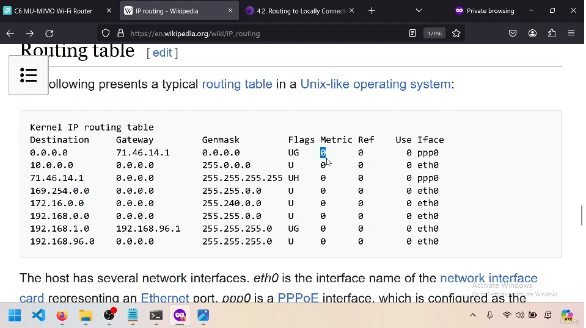

---  
---  

1 : What is the primary purpose of an IP address in a network?  

a) To assign a name to a device for easy identification  
b) To determine the correct route for a packet to reach its destination  
c) To secure the network from unauthorized access  
d) All of the above  

**Answer** b)  

**Description**  

The primary purpose of an IP address is to determine the correct route for a packet to reach its destination by referring to the routing table of routers.  

---  
---  

2 : In a routing table, what does the entry with the destination 0.0.0.0 and subnet mask 0.0.0.0 represent?  

a) Local route  
b) Specific route  
c) Default route  
d) Gateway route  

**Answer** c)  

**Description**  

The entry with the destination 0.0.0.0 and subnet mask 0.0.0.0 represents the default route. It matches all IP addresses and is used when no other specific route matches the destination IP.  

---  
---  

3 : Which factor is primarily used to determine the priority of a route in a routing table?  

a) The destination IP address  
b) Routes with fewer zeros in the subnet mask has more priority  
c) The gateway IP address  
d) The interface through which the packet is sent  

**Answer** b)  

**Description**  

The priority of a route in a routing table is primarily determined by the number of zeros in the subnet mask. Routes with fewer zeros in the subnet mask (more specific) have higher priority.  

---  
---  

4 : If a packet's destination IP address does not match any specific routes in the routing table, where is the packet sent?  

a) To the local interface  
b) To the default route  
c) To the error handler  
d) To the next available router randomly  

**Answer** b)  

**Description**  

If a packet's destination IP address does not match any specific routes in the routing table, it is sent to the default route.  

---  
---  

5 : What is the primary role of the metric value in a route table?  

a) To determine the security level of a route  
b) To indicate the bandwidth of a route  
c) To measure the cost or delay associated with a route  
d) To identify the protocol used for routing  

**Answer** c)  

**Description**  

The metric value in a route table measures the cost or delay associated with a particular route. Lower metric values indicate higher priority and lower delay, while higher metric values indicate higher delay and lower priority.  

---  
---  

6 : If a packet's destination IP address (D) is outside the current subnet, what the router should ideally do?  

a) Drop the packet  
b) Send the packet back to the sender  
c) Send the packet to the next router  
d) Deliver the packet within the same subnet  

**Answer** c)  

**Description**  

If the destination IP address is outside the current subnet, the router should ideally send the packet to the next router.  

---  
---  

7 : What command is used to display the route table on a Windows machine?  

a) ping  
b) netstat  
c) tracert  
d) route print  

**Answer** d)  

**Description**  

The route print command is used to display the route table on a Windows machine, showing the routes the system uses for sending packets.  

---  
---  

8 : How does the tracert (trace route) command help in networking?  

a) By measuring the bandwidth of a network  
b) By showing the path packets take to reach a destination  
c) By encrypting network data  
d) By displaying the ARP table  

**Answer** b)  

**Description**  

The tracert command helps in networking by showing the path packets take to reach a destination, including each hop and the time taken for each hop.  

---  
---  

9 : What information is typically included in a route table entry?  

  

a) Destination IP, gateway, subnet mask, flags, metric, and interface  
b) Source IP, MAC address, protocol, and encryption type  
c) Bandwidth, latency, jitter, and packet loss  
d) Domain name, TTL, and DNS server  

**Answer** a)  

**Description**  

A route table entry typically includes the destination IP, gateway, subnet mask, flags, metric, and interface, which together determine how packets are routed through the network.  

---  
---  

10 : Which of the following best describes a "hop" in the context of the tracert command?  

a) The time it takes for a packet to travel from source to destination  
b) A step along the route where the packet is forwarded from one router to another  
c) The encryption protocol used during the data transfer  
d) The total number of packets sent  

**Answer** b)  

**Description**  

A "hop" in the context of the tracert command refers to each step along the route where the packet is forwarded from one router to another.  

---  
---  

