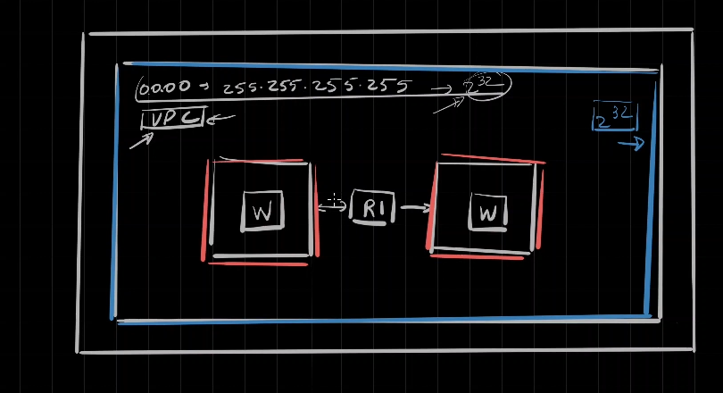

---  
---  

1 : What is "Link" in the context of networking?  

a) The connection between two devices  
b) A chunk of data  
c) A DHCP Client Table  
d) None of the above  

**Answer** a)  

**Description**  

A link refers to the connection or medium by which two devices/nodes are connected in a network.  

---  
---  

2 : What is "datagram" in the context of networking?  

a) A small network diagram  
b) A chunk of data or packet  
c) A physical connection point in a network  
d) None of the above  

**Answer** b)  

**Description**  

Datagram can be described as a chunk of data.  

---  
---  

3 : What is a Virtual Private Cloud (VPC) in AWS?  

a) A software application for network management  
b) A set of IP addresses or a network  
c) An encryption method for cloud data  
d) None of the above  

**Answer** b)  

**Description**  

A Virtual Private Cloud (VPC) in AWS is described as a set of IP addresses or a network, essentially forming a logical boundary for networking within the cloud environment.  

---  
---  

4 : In the below picture, what is represented as the blue box?  

  

a) AWS VPC  
b) AWS SG  
c) AWS Nat gateway  
d) None of the above  

**Answer** a)  

**Description**  

The blue box represents an AWS VPC.  

---  
---  

5 : What does the coral box represents in the below diagram?  

  

a) AWS VPC  
b) AWS SG  
c) AWS NAT gateway  
d) Subnet inside AWS VPC  

**Answer** d)  

**Description**  

It represents two subnets inside an AWS VPC.  

---  
---  

6 : According to the diagram, how the subnets are connected?  

