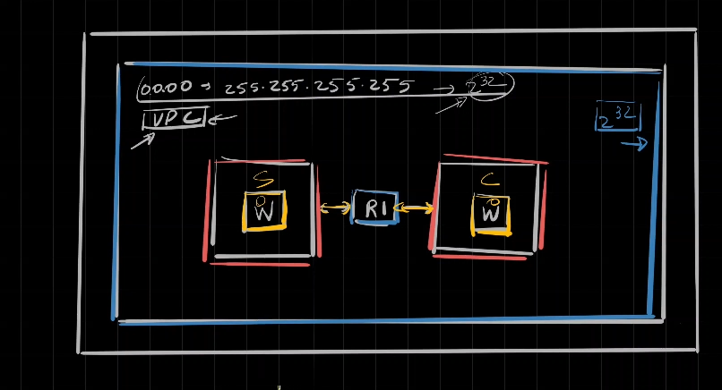

---  
---  

1 : What is "Link" in the context of networking?  

a) The connection between two devices  
b) A chunk of data  
c) A DHCP Client Table  
d) None of the above  

**Answer** a)  

**Description**  

A link refers to the connection or medium by which two devices/nodes are connected in a network.  

---  
---  

2 : What is "datagram" in the context of networking?  

a) A small network diagram  
b) A chunk of data or packet  
c) A physical connection point in a network  
d) None of the above  

**Answer** b)  

**Description**  

Datagram can be described as a chunk of data.  

---  
---  

3 : What is a Virtual Private Cloud (VPC) in AWS?  

a) A software application for network management  
b) A set of IP addresses or a network  
c) An encryption method for cloud data  
d) None of the above  

**Answer** b)  

**Description**  

A Virtual Private Cloud (VPC) in AWS is described as a set of IP addresses or a network, essentially forming a logical boundary for networking within the cloud environment.  

---  
---  

4 : In the below picture, what is represented as the blue box?  

  

a) AWS VPC  
b) AWS SG  
c) AWS Nat gateway  
d) None of the above  

**Answer** a)  

**Description**  

The blue box represents an AWS VPC.  

---  
---  

5 : What does the coral box represents in the below diagram?  

  

a) AWS VPC  
b) AWS SG  
c) AWS NAT gateway  
d) Subnet inside AWS VPC  

**Answer** d)  

**Description**  

It represents two subnets inside an AWS VPC.  

---  
---  

6 : According to the diagram, how the subnets are connected?  

  

a) Using a router named R1  
b) Using a router named W  
c) It is a private subnet and has no connection between the two  
d) None of the above  

**Answer** a)  

**Description**  

The two subnets in the VPC are interconnected using the router name R1 according to the provided diagram.  

---  
---  

7 : Why do we need a router R1 in the below diagram?  

  

a) Since the Windows systems are in different subnets a router is needed for the communication between them  
b) Since the windows systems are in the same subnet a router is needed for the communication between them  
c) A router is not an integral part in the architecture shown in the above diagram  
d) None of the above  

**Answer** a)  

**Description**  

Correct. Since the Windows systems are running in different subnets a router is needed for the communication between them.  

---  
---  

8 : What is the purpose of the local route in the VPC’s route table?  

a) To route traffic to the Internet Gateway  
b) To route traffic within the VPC  
c) To route traffic to another VPC  
d) To block external traffic from entering the VPC  

**Answer** a)  

**Description**  

The local route in the VPC's route table (172.31.0.0/16) ensures that traffic within this range is routed locally within the VPC, facilitating internal communication.  

---  
---  

9 : What is the significance of enabling ICMP in the security group for an EC2 instance?  

a) To allow HTTP traffic  
b) To enable SSH access  
c) To allow ping requests  
d) To enable RDP access  

**Answer** c)  

**Description**  

Enabling ICMP in the security group allows the EC2 instance to respond to ping requests, which is useful for network diagnostics.  

---  
---  

10 : What is the approximate number of IP addresses available in a /20 subnet?  

a) 256  
b) 1024  
c) 4096  
d) 8192  

**Answer** c)  

**Description**  

A /20 subnet provides 4096 IP addresses (2^12 = 4096) as it allows for 12 bits of host addresses (32-20=12).  

---  
---  

11 : Which protocol is commonly used to remotely access a server in a Windows environment?  

a) SSH  
b) RDP (Remote Desktop Protocol)  
c) VNC  
d) Telnet  

**Answer** b)  

**Description**  

RDP is the protocol used for remote access to a server in a Windows environment.  

---  
---  

12 : What is the significance of running the command curl localhost:65432 in the server in this context?  

a) To verify internet connectivity  
b) To check if the server is listening on the specified port  
c) To download files from the server  
d) To upload files to the server  

**Answer** b)  

**Description**  

The command curl localhost:65432 is used to verify that the server is correctly listening on port 65432. The local host is the IP address 127.0.0.1.  This command is used to ensure that the server application is properly set up and running.  

---  
---  

