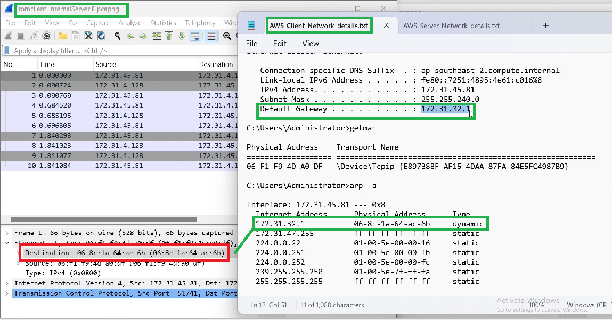
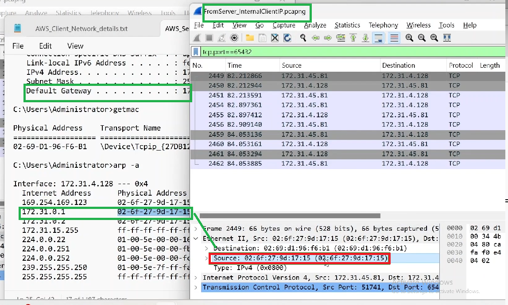

---  
---  

1 : Why do the source and destination IP addresses of the SYN packet match in the client and server Wireshark traces, despite being in different subnets?  

  

a) Because NAT is used between them  
b) Because they are on two different VPC  
c) Because they are on a fully routable network without NAT  
d) Because they use the same MAC addresses  

**Answer** c)  

**Description**  

The client and server IP addresses match in the traces despite being in different subnets because they are communicating over a routable network without Network Address Translation (NAT) involved.  

---  
---  

2 : Why is the destination MAC address in the client and the source MAC address in the server of the SYN packet in Wireshark traces different?  

  

a) The client and server are on the same subnet  
b) The client and server are in different VPC  
c) The client and server are in different subnets, and the packets are routed through default gateways  
d) The server is using Network Address Translation (NAT)  

**Answer** c)  

**Description**  

When packets are routed between subnets, they pass through default gateways, which results in different MAC addresses at each hop.  

---  
---  

3 : Whose MAC address is the destination MAC address in the client trace in the SYN packet?  

  

a) The MAC address of the server  
b) The MAC address of the remote laptop  
c) The MAC address of the Default gateway of the client  
d) None of the above  

**Answer** c)  

**Description**  

The server is in a different subnet, so the client's packets are sent to it's default gateway. Therefore, the destination MAC address in the client trace is the MAC address of the default gateway, not the server’s MAC address.  

---  
---  

4 : Whose MAC address is the source MAC address in the server trace in the SYN packet?  

  

a) The MAC address of the client  
b) The MAC address of the server  
c) The MAC address of the default gateway of the server  
d) The MAC address of the remote laptop  

**Answer** c)  

**Description**  

In the server trace, the source MAC address belongs to the default gateway or router that sits within the server's subnet.  

---  
---  

5 : Which command to run to get the MAC address of the client NIC card in Windows system?  

a) ipconfig  
b) arp -a  
c) netstat  
d) getmac  

**Answer** d)  

**Description**  

The getmac command output helps verify the MAC address of the client NIC card, the getmac command is used to check the MAC address.  

---  
---  

