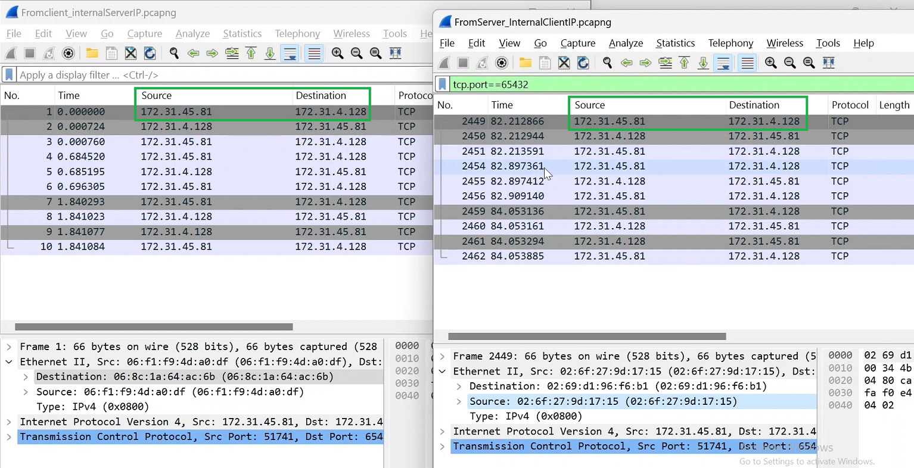
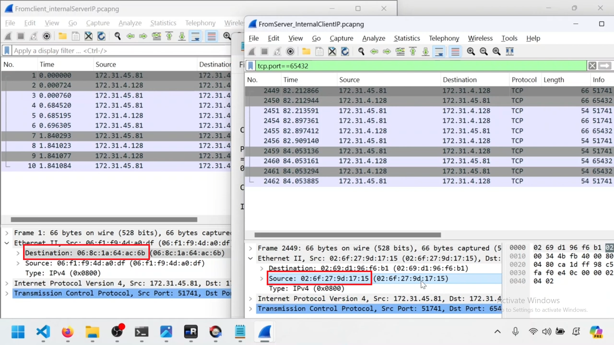

---  
---  

1 : Why do the source and destination IP addresses of the SYN packet match in the client and server Wireshark traces, despite being in different subnets?  

  

a) Because NAT is used between them  
b) Because they are on two different VPC  
c) Because they are on a fully routable network without NAT  
d) Because they use the same MAC addresses  

**Answer** c)  

**Description**  

The client and server IP addresses match in the traces despite being in different subnets because they are communicating over a routable network without Network Address Translation (NAT) involved.  

---  
---  

2 : Why is the destination MAC address in the client and the source MAC address in the server of the SYN packet in Wireshark traces different?  

  
