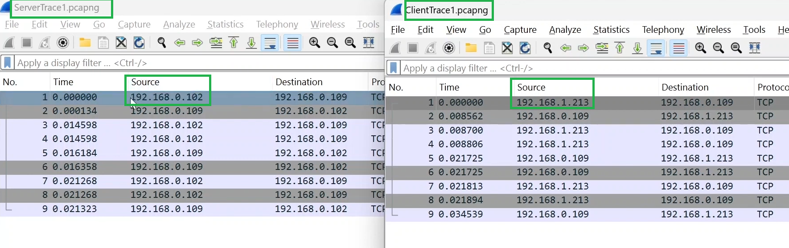
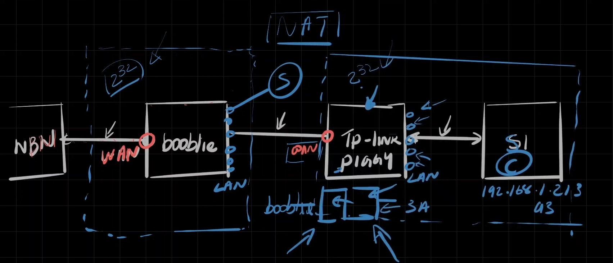
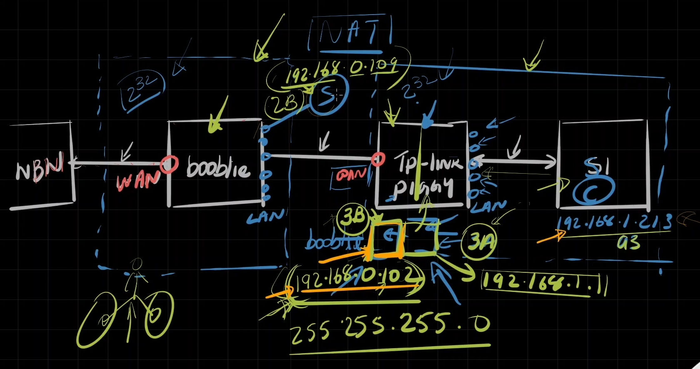
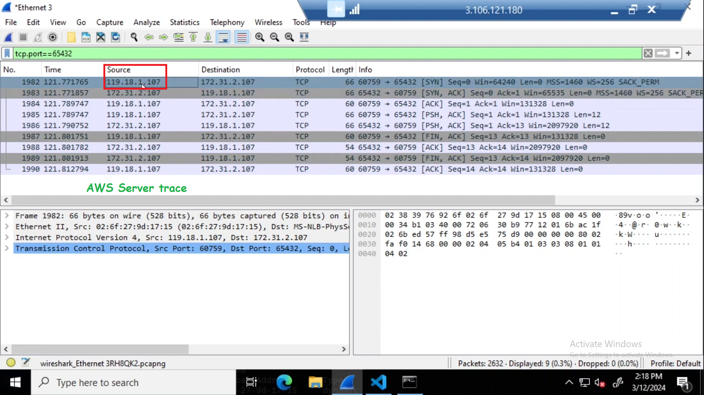

---  
---  

1 : The traffic goes outside to the internet through _______ port of the Router.  

a) LAN  
b) WAN  
c) Both of the above  
d) None of the above  

**Answer** b)  

**Description**  

WAN is Wide Area network. The traffic goes outside to the internet through the WAN port of the Router.  

---  
---  

2 : _______ is one of the ways to connect two distinct networks.  

a) NAT  
b) DHCP  
c) Both of the above  
d) None of the above  

**Answer** a)  

**Description**  

NAT is one of the ways to connect two distinct networks. Two distinct networks means two distinct 2^32 IP addresses.  

---  
---  

3 : Which statement is true about NAT?  

a) NAT translates private IP addresses in an internal network to a public IP address before packets are sent to an external network  
b) NAT always provides end-to-end security  
c) NAT is routing inside a subnet  
d) All the above  

**Answer** a)  

**Description**  

Correct. NAT translates private IP addresses in an internal network to a public IP address before packets are sent to an external network.  

---  
---  

4 : Why does the IP address of the client change when viewed from the server's perspective in a NAT setup (SYN packet)?  

  

a) The server's firewall modifies the IP address  
b) The client's operating system changes the IP address dynamically  
c) The client router replaces the client's IP address with its own IP address  
d) The client uses a different IP address for each connection attempt  

**Answer** c)  

**Description**  

In a NAT setup, the router translates the private IP address of the client to its own IP address before forwarding the packet to the server. This process is called NATing.  

---  
---  

5 : In the context of the provided scenario, which device is performing NAT?  

  

a) The client laptop (S1)  
b) Router Piggy  
c) The ISP's gateway  
d) Router booblie  

**Answer** b)  

**Description**  

The router Piggy performs NAT by translating the private IP addresses of devices within the home network (like S1) to its own IP address before sending traffic to the second router booblie and beyond.  

---  
---  

6 : NATing is mostly for _______ traffic.  

a) Incoming  
b) Outgoing  
c) Both incoming and outgoing traffic  
d) None of the above  

**Answer** b)  

**Description**  

NAT is mostly for outgoing or outbound traffic.  

---  
---  

7 : What happens to the MAC and IP addresses when a packet passes from client to server through Piggy router during NAT?  

a) The MAC address changes, but the IP address remains the same  
b) The IP address changes, but the MAC address remains the same  
c) Both the MAC address and the IP address change  
d) Neither the MAC address nor the IP address change  

**Answer** c)  

**Description**  

Piggy changes both the MAC address and the IP address during the NAT process. The MAC address is translated to Piggy's MAC address, and the IP address is translated to the IP address of the interface of piggy connected to the server's network.  

---  
---  

8 : Which of the following correctly describes Piggy's two MAC addresses?  

  

a) Both MAC addresses are the same  
b) One MAC address is for LAN, and the other is for WAN  
c) One MAC address is for Wi-Fi, and the other is for Ethernet  
d) None of the above  

**Answer** b)  

**Description**  

Piggy has one MAC address for the LAN connection (to S1) and another MAC address for the WAN connection to booblie router.  

---  
---  

9 : Why does the Piggy router need to have two different IP addresses?  

a) To act as a DHCP server for both subnets  
b) To bridge two distinct networks through Network Address Translation (NAT)  
c) To provide a backup IP address in case one fails  
d) To separate internal and external traffic  

**Answer** b)  

**Description**  

The Piggy router uses two different IP addresses to bridge two distinct IP networks through NAT.  

---  
---  

10 : What are the two networks to which the Piggy router is connected?  

  

a) 192.168.1.0/24 and 192.168.0.0/24  
b) 192.168.1.0/24 and 10.0.0.0/24  
c) 10.0.0.0/24 and 172.16.0.0/16  
d) 192.168.0.0/24 and 172.16.0.0/16  

**Answer** a)  

**Description**  

The Piggy router connects to two distinct networks: 192.168.1.0/24 and 192.168.0.0/24, facilitating communication between them through NAT.  

---  
---  

11 :Which IP address does the Piggy router use in the network connected to S1 (the client laptop)?  

  

a) 192.168.0.102  
b) 192.168.1.1  
c) 192.168.1.213  
d) 192.168.0.19  

**Answer** b)  

**Description**  

The Piggy router uses the IP address 192.168.1.1 in the network connected to S1, serving as the default gateway for devices in this network.  

---  
---  

12 : Which IP address does the Piggy router use in the network connected to the booblie router as per the diagram below?  

  

a) 192.168.1.213  
b) 192.168.1.1  
c) 192.168.0.102  
d) 192.168.0.19  

**Answer** c)  

**Description**  

The Piggy router uses the IP address 192.168.0.102 in the network connected to the booblie router, allowing it to route traffic between the two networks.  

---  
---  

13 : Which of the following is true about the two IP addresses of the Piggy router?  

a) Both IP addresses belong to the same network  
b) Each IP address is associated with a different network  
c) One IP address is for IPv4 and the other is for IPv6  
d) None of the above  

**Answer** b)  

**Description**  

The Piggy router has one IP address in the 192.168.1.0/24 network and another in the 192.168.0.0/24 network, allowing it to route traffic between these two distinct networks.  

---  
---  

14 : Which among is true about the client and server and piggy router in the following setup?  

  

a) The client and server are in different subnets of the same network  
b) The client and server are in different networks. Client is in 192.168.1.0/24 network and server is in 192.168.0.0/24 network  
c) Piggy Router is part of 2 networks which is 192.168.1.0/24 network and 192.168.0.0/24  
d) Both b and c  

**Answer** d)  

**Description**  

Correct.The client and server are in different networks. Client is in 192.168.1.0/24 network and server is in 192.168.0.0/24 network. That is the reason we used NETWORK address translation because they are in 2 different networks.Piggy Router is part of 2 networks which is 192.168.1.0/24 network and 192.168.0.0/24. It has an IP address in the server's network as well as the client's network.  

---  
---  

15 : _______ is a part of the internet.  

a) Private IP address  
b) Public IP address  
c) Both of the above  
d) None of the above  

**Answer** b)  

**Description**  

Public IP address is a part of the internet. It is seen by everyone in the world.  

---  
---  

16 : Why the client and server cannot see each other's internal IP addresses directly?  

a) Due to firewall restrictions  
b) Because of different subnets  
c) Because of network address translation (NAT)  
d) Due to different network protocols  

**Answer** c)  

**Description**  

It is due to network address translation (NAT).  

---  
---  

17 : What does the '0.0.0.0' address signify when configuring the server to listen on a port?  

a) It listens on a specific IP address  
b) It listens on all available IP addresses on all network interfaces  
c) It restricts listening to local traffic only  
d) It blocks all incoming connections  

**Answer** b)  

**Description**  

The '0.0.0.0' address configures the server to listen on all available IP addresses on all network interfaces available in that system or vm.  

---  
---  

18 : What protocol is specified by socket.AF_INET in the server code?  

a) UDP  
b) TCP  
c) IP  
d) HTTP  

**Answer** c)  

**Description**  

socket.AF_INET specifies the Internet Protocol (IP) for the network communication.  

---  
---  

19 : Whose IP address is 119.18.1.107 shown up in the server trace of SYN packet as Source IP?  

  

a) Private IP address of client  
b) Public IP address of client  
c) Private IP address of server  
d) Public IP address of server  

**Answer** b)  

**Description**  

The public IP address of a client is the IP address assigned by the client's Internet Service Provider (ISP) that is visible to the external world. Multiple steps of natting occurs in this scenario.  When a client device connects to the internet through a router,  the router uses NAT to manage multiple devices on the local network, translating private IP addresses (used within the local network) to the public IP address.  

---  
---  

20 : 

