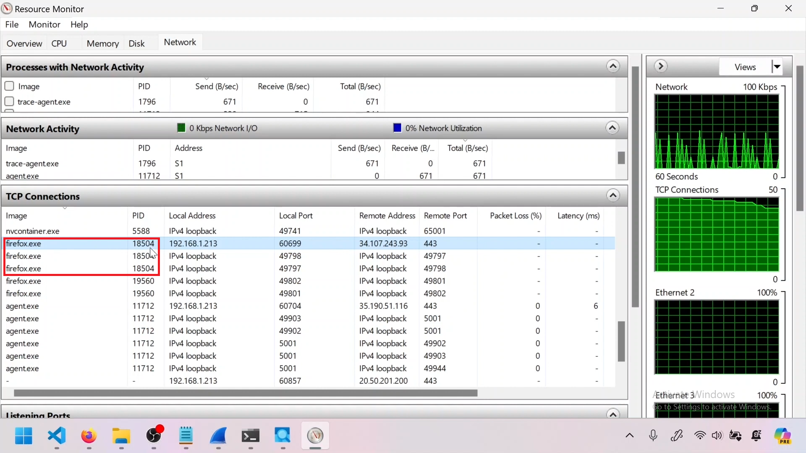
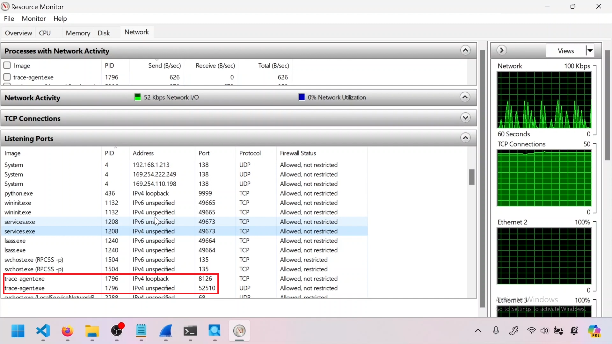

---  
---  

1 : How many threads does the process with PID 18504 have according to the image below?  

  

a) 5  
b) 10  
c) 0  
d) 3  

**Answer** d)  

**Description**  

There are 3 threads of the same process running simultaneously.  

---  
---  

2 : Why does the same process listening on different port?  

  

a) To handle multiple services and to distribute load  
b) To avoid network congestion caused by other processes  
c) To make use of all the available ports in the system so none goes waste  
d) None of the above  

**Answer** a)  

**Description**  

The same process listens on different ports to handle multiple services, distribute load, ensure compatibility, and provide redundancy. Different threads of the same process can listen on different ports.  

---  
---  

