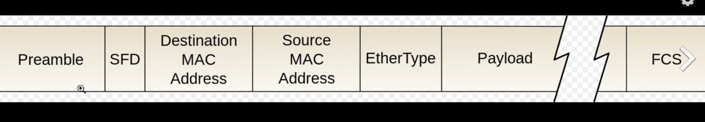

---  
---  

1 : What is the primary purpose of the preamble in an Ethernet frame?  

a) To identify the source MAC address  
b) To synchronize the clock between the source and destination  
c) To check for data corruption  
d) To indicate the type of protocol used  

**Answer** b)  

**Description**  

The preamble is a sequence of alternating ones and zeros used to synchronize the clocks of the sending and receiving devices.  

---  
---  

2 : Which of the following best describes the structure of an Ethernet frame?  

a) Preamble, Start Frame Delimiter, source MAC address, Destination MAC address, EtherType, Payload, Frame Check Sequence  
b) Preamble, source MAC address, Destination MAC address, IP Header, Payload, Frame Check Sequence  
c) Preamble, IP Header, TCP Header, Payload, Frame Check Sequence  
d) Source MAC address, Destination MAC address, IP Header, TCP Header, Payload, Frame Check Sequence  

**Answer** a)  

**Description**  

The Ethernet frame has Preamble, Start Frame Delimiter, source MAC address, Destination MAC address, EtherType, Payload, Frame Check Sequence.  

---  
---  

3 : Which field in the Ethernet frame specifies the protocol type of the payload?  

  

a) Source MAC address  
b) Destination MAC address  
c) EtherType  
d) Frame Check Sequence (FCS)  

**Answer** c)  

**Description**  

The EtherType field in an Ethernet frame specifies the protocol type of the payload eg.ARP.  

---  
---  

4 : What is the primary purpose of the Time-to-Live (TTL) field in an IP header?  

a) To specify the total length of the IP packet  
b) To indicate the priority of the packet  
c) To limit the lifetime of a packet  
d) To identify the protocol used in the payload  

**Answer** c)  

**Description**  

The Time-to-Live (TTL) field in an IP header is used to limit the lifespan of a packet in a network. Each router that forwards the packet decreases the TTL value by one. When the TTL reaches zero, the packet is discarded. This mechanism prevents packets from circulating indefinitely in case of routing loops.  

---  
---  

5 : Which of the following fields is unique to the TCP header and not found in the UDP header?  

a) Source Port  
b) Destination Port  
c) Sequence Number  
d) Checksum  

**Answer** c)  

**Description**  

The Sequence Number field is unique to the TCP header and is used for ensuring reliable data transfer by keeping track of the data segments.  

---  
---  

6 : What does the Window Size field in the TCP header represent?  

a) The size of the TCP header  
b) The size of the payload data  
c) The amount of data the receiver can accept  
d) The total length of the TCP segment  

**Answer** c)  

**Description**  

The Window Size field specifies the amount of data that the receiver is willing to accept and helps in flow control.  

---  
---  

7 : What is the purpose of padding in the TCP header?  

a) To indicate the start of a frame  
b) To synchronize the clock between source and destination  
c) To ensure data ends on a specific bit boundary for efficient processing  
d) To identify fragmented packets  

**Answer** c)  

**Description**  

Correct. Padding aligns the data on a bit boundary that matches the processing requirements of the system.   

---  
---  

