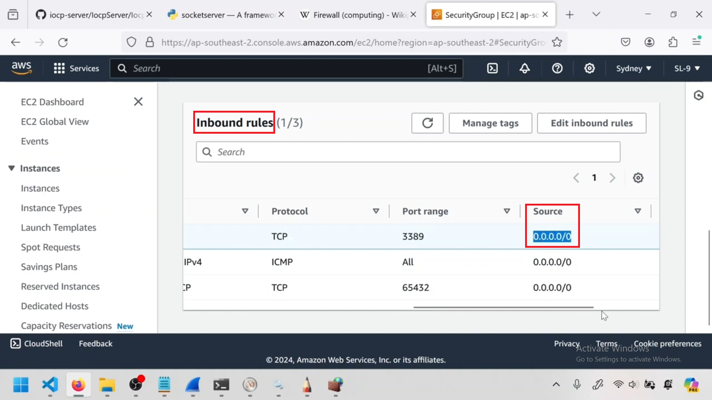

---  
---  

1 : What is the primary function of a firewall in networking?  

a) Allowing unrestricted access to network resources  
b) Filtering network traffic based on specified rules  
c) Controlling physical access to network devices  
d) Monitoring network bandwidth usage  

**Answer** b)  

**Description**  

Firewalls are designed to filter and control the flow of network traffic based on predefined rules to enhance security.  

---  
---  

2 : Which command is used to access the Windows Firewall with Advanced Security in Windows?  

a) netsh firewall show  
b) firewall-cmd  
c) iptables  
d) wf.msc  

**Answer** d)  

**Description**  

The wf.msc command is used to open the Windows Firewall with Advanced Security console in Windows, allowing for advanced configuration of firewall rules.  

---  
---  

3 : Which among is the firewall in Linux systems?  

a) wf.msc  
b) Security group  
c) NACL  
d) iptable  

**Answer** d)  

**Description**  

Iptables is a standard firewall included in most Linux distributions by default.  

---  
---  

4 : Which type of firewall rule controls traffic entering a system from an external source?  

a) Outbound  
b) Inbound  
c) Egress  
d) Internal  

**Answer** b)  

**Description**  

Inbound (or ingress) firewall rules control the traffic entering a system from external sources, ensuring only authorized traffic is allowed in.  

---  
---  

5 : Which type of firewall rule controls traffic leaving a system to an external destination?  

a) Inbound  
b) Outbound  
c) Internal  
d) Gateway  

**Answer** b)  

**Description**  

Outbound (or egress) firewall rules control the traffic leaving a system to external destinations, ensuring that only authorized traffic is sent out.  

---  
---  

6 : In an AWS Security Group, what does an inbound rule allowing port 3389 from source 0.0.0.0/0 signify?  

  

a) It allows outgoing traffic to all IP address  
b) It blocks all incoming traffic to port 3389  
c) It allows incoming traffic from any IP address to port 3389  
d) None of the above  

**Answer** c)  

**Description**  

Port 3389 is used for Remote Desktop Protocol (RDP), and source 0.0.0.0/0 means any IP address can connect to the port 3389.  

---  
---  

