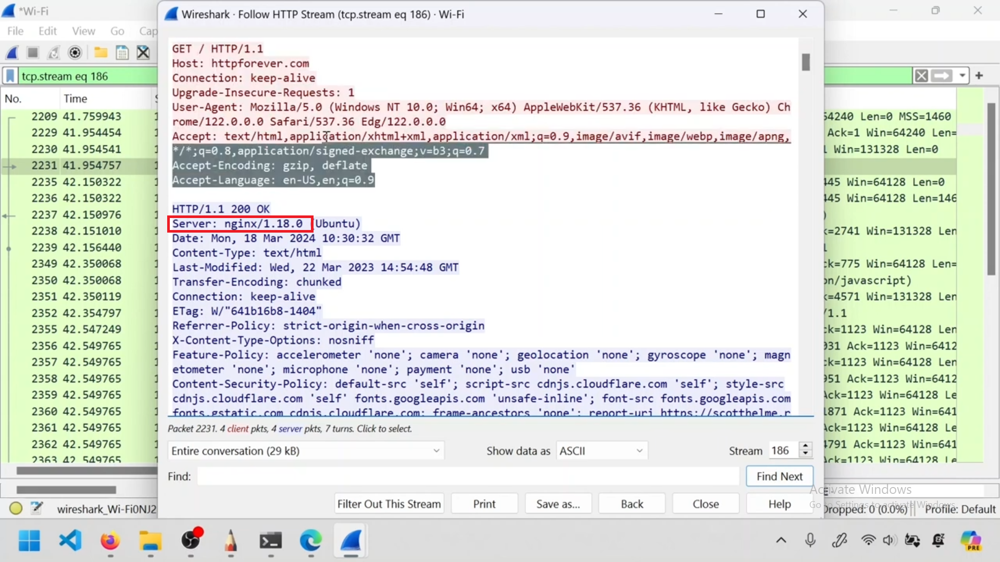

---  
---  

1 : HTTP is _______.  

a) Hyper Text Transfer Protocol  
b) Higher Text Transfer Protocol  
c) Any of the above  
d) None of the above  

**Answer** a)  

**Description**  

HTTP is Hyper Text Transfer Protocol.  

---  
---  

2 : _______ is the encrypted version of HTTP.  

a) TCP  
b) UDP  
c) HTTPS  
d) All of the above  

**Answer** c)  

**Description**  

 HTTPS is the encrypted version of HTTP.  

 ---  
 ---  

 3 : Port number of HTTP is _______.  

 a) 443  
 b) 80  
 c) 22  
 d) None of the above  

**Answer** b)  

**Description**  

80 is the Port number of HTTP.  

---  
---  

4 : Port number of HTTPS is _______.  

a) 443  
b) 80  
c) 22  
d) None of the above  

**Answer** a)  

**Description**  

443 is the Port number of HTTPS.  

---  
---  

5 : HTTP is considered as a _______ layer protocol.  

a) Physical layer  
b) Application layer  
c) Any of the above  
d) None of the above  

**Answer** b)  

**Description**  

HTTP is considered as an Application layer or Layer 7 protocol.  

---  
---  

6 : Examples of Web servers include _______.  

a) nginx  
b) Apache web server  
c) Tomcat  
d) All of the above  

**Answer** d)  

**Description**  

 All are examples of Web servers.  

 ---  
 ---  

 7 : HTML is _______.  

 a) Description language of a web page  
 b) Hyper Text Mark-up Language  
 c) Both of the above  
 d) None of the above  

**Answer** d)  

**Description**  

HTML is the Description language of a web page. HTML is Hyper Text Mark-up Language. Both are correct.  

---  
---  

8 : Which among the following are HTTP clients?  

a) Web browsers  
b) Curl  
c) wget  
d) All the above  

**Answer** d)  

**Description**  

Web browsers like Chrome, Firefox, and others serve as HTTP clients, enabling users to access and interact with web pages and resources over the internet. Curl and wget are also HTTP clients.  

---  
---  

9 : Which statement/s is/are correct regarding HTTP and HTTPS?  

a) HTTP uses port 80, while HTTPS uses port 443  
b) HTTPS is a secure protocol, while HTTP is not  
c) HTTPS encrypts data, while HTTP does not  
d) All the above  

**Answer** d)  

**Description**  

HTTP operates over port 80, while HTTPS operates over port 443. HTTPS encrypts the data transmitted between the client (browser) and the server, ensuring data integrity and confidentiality. In contrast, HTTP transmits data in plain text, making it vulnerable to interception and tampering.  

---  
---  

10 : Which HTTP method is being used in the given scenario to request the homepage of httpforever.com?  

  

a) POST  
b) PUT  
c) GET  
d) DELETE  

**Answer** c)  

**Description**  

The HTTP method used to request the homepage of a website is "GET."  

---  
---  

11 : What does the "Host" in an HTTP GET request signify?  

  

a) The type of content being requested  
b) The IP address of the client  
c) The server to which the request is being sent  
d) The HTTP method being used  

**Answer** c)  

**Description**  

The Host HTTP request header specifies the server to which the request is being sent.  

---  
---  

12 : Which HTTP request header is used to specify the type of data the client can handle in the response?  

  

a) User-Agent  
b) Accept  
c) Content-Type  
d) Cache-Control  

**Answer** b)  

**Description**  

The "Accept" header specifies the media types that are acceptable for the response, indicating the type of data the client can handle.  

---  
---  

13 : In the context of HTTP responses, the status code "200 OK" indicates that:  

  

a) The HTTP request was successful  
b) The server encountered an error while processing the request  
c) The requested resource has moved permanently to a new URL  
d) None of the above  

**Answer** a)  

**Description**  

The HTTP response status code "200 OK" signifies that the server has successfully processed the client's request.  

---  
---  

14 : In an HTTP response, the "Content-Type" header is used to specify:  

  

a) The size of the response body in bytes  
b) The server's hostname and port number  
c) The original type of data in the body of the response message  
d) None of the above  

**Answer** c)  

**Description**  

The "Content-Type" header in an HTTP response specifies the type of the data in the response body, such as "text/html" for HTML documents or "application/json" for JSON data.  

---  
---  

15 : When a server sends an HTTP response with the "Server" header set to "nginx/1.18.0 (Ubuntu)", what does this indicate?  

  

a) The version of the HTTP protocol used by the server  
b) The Domain name of the client  
c) The name and version of the web server software  
d) The encryption method used to secure the HTTP connection  

**Answer** c)  

**Description**  

The "Server" header in an HTTP response typically identifies the name and version of the web server software handling the request, such as "Apache/2.4.41 (Unix)" or "nginx/1.18.0 (Ubuntu)" (in this case) indicating nginx version 1.18.0 running on Ubuntu.  

---  
---  

16 : What is the primary function of an HTTP proxy within a secure network?  

a) To directly connect the client to the server without any intermediaries  
b) HTTP proxy acts like a Layer 3 protocol  
c) For monitoring the traffic and security purposes  
d) All the above  

**Answer** c)  

**Description**  

An HTTP proxy acts as a middleman between the client and the target server. The proxy allows the user to route their traffic through the proxy servers, which provides enhanced online security and anonymity.  

---  
---  

17 : Where can you find the proxy settings in the Windows?  

  

a) DNS settings  
b) System  
c) Network & Internet  
d) Privacy  

**Answer** c)  

**Description**  

The proxy settings can be found under "Network &amp; Internet" in the Windows Settings.  

---  
---  

18 : How does an HTTP proxy handle requests for external websites from clients within a secure network?  

a) By blocking all requests to external websites  
b) By redirecting requests to a local cache  
c) By forwarding the requests to the external websites and returning the responses to the clients  
d) By directly connecting clients to the external websites  

**Answer** c)  

**Description**  

An HTTP proxy forwards requests from clients to external websites and returns the responses to the clients, acting as an intermediary.  

---  
---  

19 : Why might an organization choose to decrypt and inspect HTTP traffic using a proxy?  

a) To reduce bandwidth usage  
b) To improve website loading times  
c) To detect and prevent data breaches or the transmission of sensitive information  
d) To provide users with faster internet access  

**Answer** c)  

**Description**  

An organization might decrypt and inspect HTTP traffic using a proxy to detect and prevent data breaches or the transmission of sensitive information, ensuring compliance with security policies.  

---  
---  

20 : What is the primary difference between an HTTP proxy and NAT (Network Address Translation)?  

a) An HTTP proxy operates at the IP layer, while NAT operates at the application layer  
b) An HTTP proxy operates at the application layer, while NAT operates at the IP layer  
c) An HTTP proxy is used for DNS resolution, while NAT is used for routing  
d) None of the above  

**Answer** b)  

**Description**  

An HTTP proxy operates at the application layer, specifically handling HTTP traffic, while NAT operates at the IP layer, handling network traffic by translating IP addresses.  

---  
---  

21 : What does it mean when a browser is configured to bypass the proxy for certain addresses?  

a) The browser will not use the proxy for specified addresses  
b) The browser will disable all proxy settings for the non specified addresses  
c) The browser will use a different proxy server for specified addresses  
d) The browser will use the proxy for all addresses  

**Answer** a)  

**Description**  

When a browser is configured to bypass the proxy for certain addresses, it means that the browser will not use the proxy for specified internal or trusted addresses, allowing direct access.  

---  
---  

22 : When configuring a manual proxy server, what information must you provide?  

  

a) Proxy server address and port number  
b) DHCP server address  
c) DNS server address  
d) Subnet mask and default gateway  

**Answer** a)  

**Description**  

When configuring a manual proxy server, you must provide the proxy server address and port number.  

---  
---  

