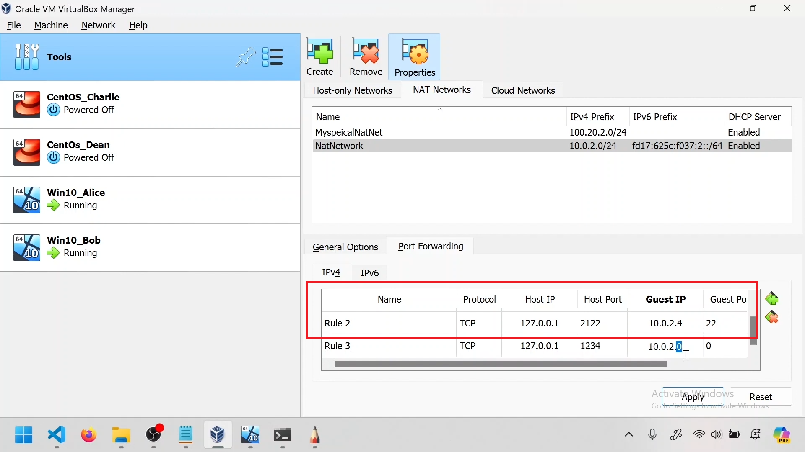
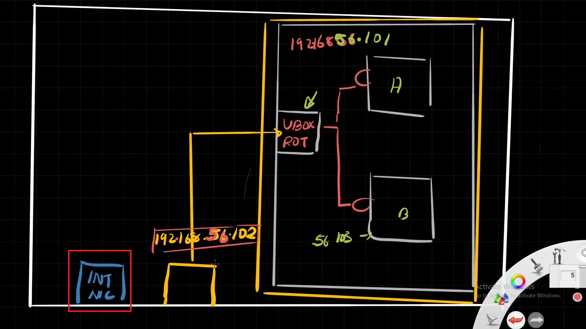
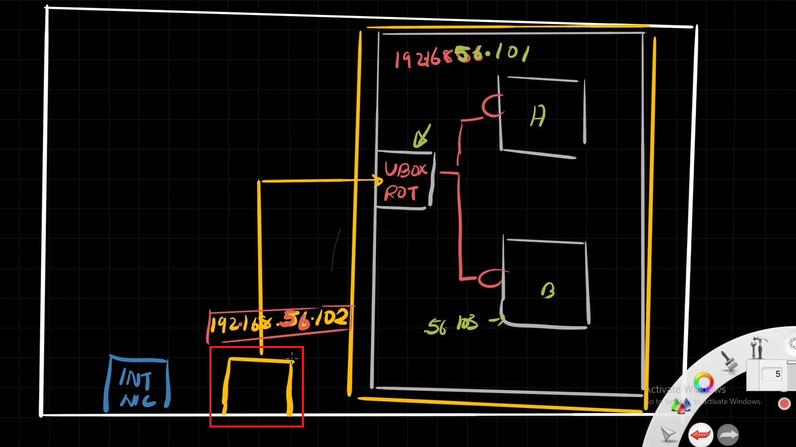

---  
---  

1 : What is the primary function of port mapping in VirtualBox networking?  

a) To provide secure encryption for data transmission between virtual machines and external networks  
b) To assign unique IP addresses to each VM in the network  
c) To forward traffic from a specific port on the host to a specific port on a VM  
d) None of the above  

**Answer** c)  

**Description**  

Port mapping, also known as port forwarding, allows traffic arriving at a specific port on the host machine to be redirected to a specific port on a VM. This enables communication between different IP spaces by proxying the traffic through specified ports.  

---  
---  

2 : When setting up port mapping in VirtualBox, which informations are essential for each port forwarding rule?  

  

a) Guest OS version and host IP address  
b) Host IP and Host Port  
c) Guest IP and Guest Port  
d) Both b and c  

**Answer** d)  

**Description**  

When setting up port mapping, the host port (which will receive traffic on the host machine) here 1234 and the host IP address 127.0.0.1 (here local host IP) is provided.  Correct. The guest IP address (to which the traffic will be forwarded) here 10.0.2.4 (IP address of vm) and guest port the port where the application listens in the guest (vm) which is 65342 in this case is provided.  

---  
---  

3 : What must be ensured about the host port specified in a port mapping rule?  

a) It must be the same as the guest port  
b) It must be a commonly used port like 80 or 443  
c) It must be free and not used by any other service on the host  
d) It must match the IP address of the host  

**Answer** c)  

**Description**  

The host port specified in a port mapping rule must be free and not used by any other service on the host to avoid conflicts and ensure proper forwarding of traffic.  

---  
---  

4 : Which of the following statements is true regarding port mapping in VirtualBox?  

a) Port mapping can only be used with Bridged Adapter mode  
b) Port mapping can be configured without specifying the guest IP address  
c) Port mapping allows traffic from the host to reach a VM even if they are in different IP spaces  
d) All the above  

**Answer** c)  

**Description**  

Port mapping in VirtualBox enables traffic from the host to reach a VM by forwarding traffic through specified ports.  

---  
---  

5 : What is a common use case for port mapping in VirtualBox?  

a) Running a web server on a VM that needs to be accessible from the host machine  
b) Isolating the VM completely from all networks  
c) Automatically assigning IP addresses to VMs  
d) All the above  

**Answer** a)  

**Description**  

Port mapping is commonly used to make services running on a VM, such as a web server, accessible from the host machine or other external networks by forwarding traffic to the appropriate port on the VM.  

---  
---  

6 : In a VirtualBox NAT network, what typically differentiates the host IP from the VM's IP?  

a) The host IP is always static, while the vm's IP is dynamic  
b) The host IP is always is in a different network than the IP of VM  
c) The host IP is assigned by VirtualBox, while the guest IP is assigned by the physical router  
d) None of the above  

**Answer** b)  

**Description**  

Correct. In NAT network host IP is always in a different network than the IP of vm. That is why port forwarding comes to the picture since they are in different networks.  

---  
---  

7 : When configuring port forwarding in VirtualBox, what is the significance of specifying the guest IP?  

a) It ensures that the VM has internet access  
b) It specifies the target VM that should receive the forwarded traffic  
c) It assigns a static IP address to the VM  
d) None of the above  

**Answer** b)  

**Description**  

Specifying the guest IP in port forwarding rules in VirtualBox ensures that the forwarded traffic reaches the correct VM.  

---  
---  

8 : What is a key characteristic of the Host-Only network mode in VirtualBox?  

a) It allows VMs to access the internet directly  
b) It assigns public IP addresses to VMs  
c) VM's can ping each other in Host-Only network  
d) None of the above  

**Answer** c)  

**Description**  

Virtual machines (VMs) can ping each other in a Host-only network configuration in VirtualBox.  VMs connected to the same host-only network can communicate with each other using their assigned IP addresses within that network.  

---  
---  

9 : Which scenario best describes when you would use a Host-Only network in VirtualBox?  

a) When VMs need to access external internet resources  
b) When VMs need to communicate only with each other and the host machine  
c) When VMs need to be part of the same network as physical machines  
d) None of the above  

**Answer** b)  

**Description**  

A Host-Only network is used when VMs need to communicate only with each other and the host machine, without any external internet access.  

---  
---  

10 : Which statement/s is/are TRUE about Host-Only Network in VirtualBox?  

a) Host-only networking in VirtualBox creates a private, isolated network that allows communication between the host system and VMs, as well as between VMs themselves  
b) A VirtualBox host-only adapter can also function as a DHCP server to assign ip addresses to VirtualBox virtual machines  
c) Virtual machines using host-only can't access the internet  
d) All the above  

**Answer** d)  

**Description**  

All the above statements are correct regarding Host-Only Network in VirtualBox.  

---  
---  

11 : What is shown inside the red square in the below picture in the context of Host-Only adapter in VirtualBox?  

  

a) The physical NIC card of the laptop  
b) The virtual NIC card created by the VirtualBox  
c) Both of the above  
d) None of the above  

**Answer** a)  

**Description**  

The red square shows the physical NIC card of the laptop.  

---  
---  

12 : What is shown inside the red square in the below picture in the context of Host-Only adapter in VirtualBox?  

  

a) The physical NIC card of the laptop  
b) The virtual NIC card created by the VirtualBox  
c) Both of the above  
d) None of the above  

**Answer** b)  

**Description**  

The virtual NIC card created in Host-Only mode in VirtualBox.  

---  
---  

